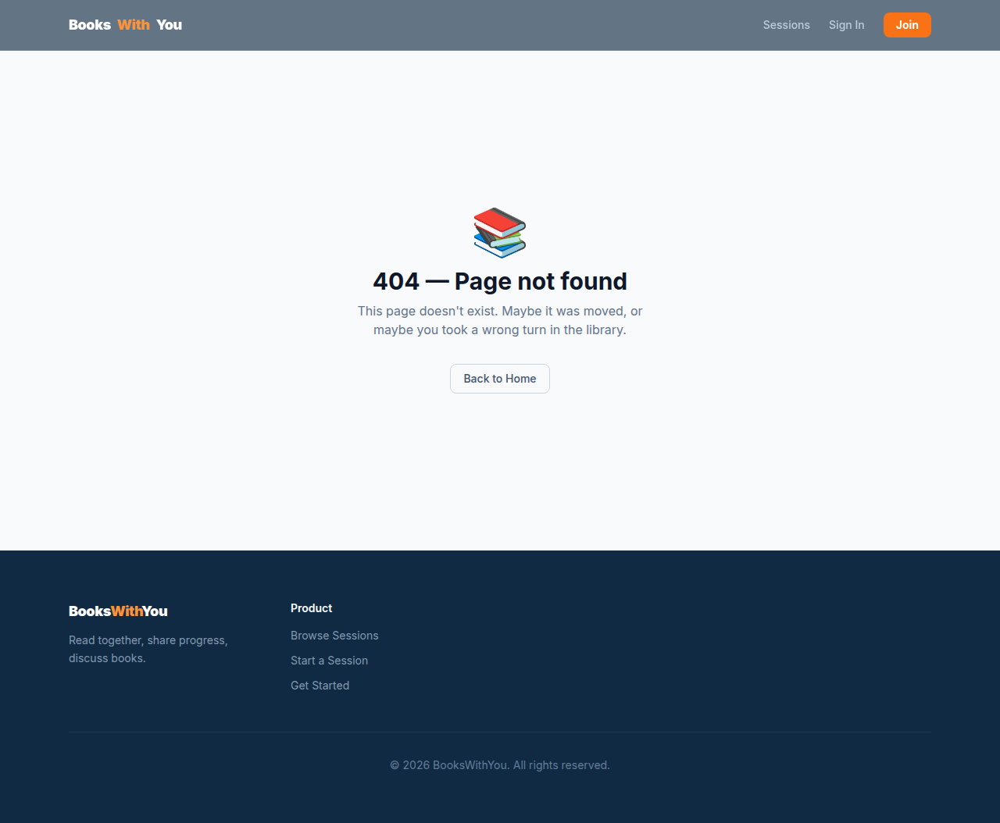
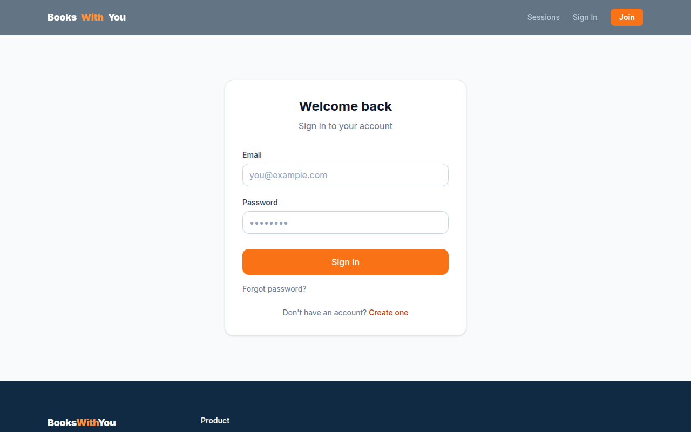
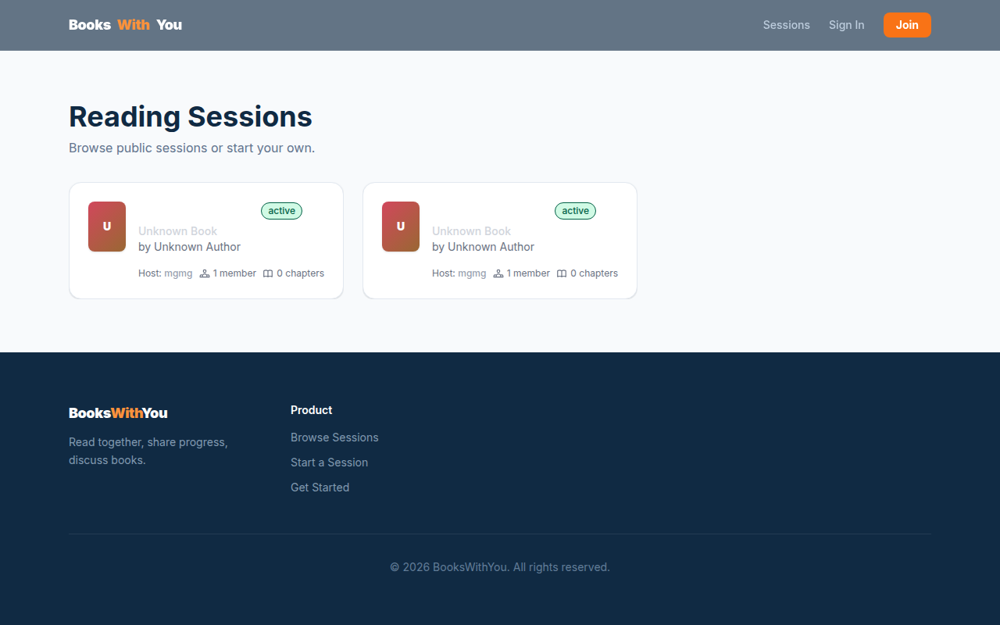
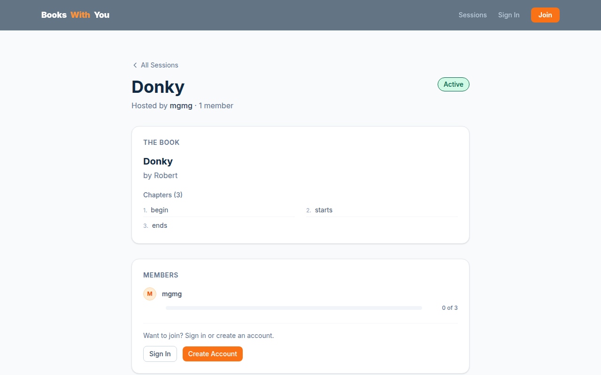

# BooksWithYou 📚

> **A social reading tracker where friends create shared book sessions, log progress together, and discuss in real time.**

## Features

- **Create sessions** — pick a book, set chapters (manual or auto-generated) or total pages, choose public or private
- **Join sessions** — browse public sessions or join via invite link
- **Track progress** — log chapters with +/- controls or enter your current page number
- **Discuss** — threaded comments with inline replies and emoji reactions in real time
- **Profiles** — upload avatars, edit your display name, view your sessions and bookshelf

## Screenshots

<p align="center">
  
  
</p>
<p align="center">
  
  
</p>

## Tech Stack

| Package | Version | Purpose |
|---------|---------|---------|
| React | 19 | UI framework |
| React Router | 7 | Client-side routing |
| TanStack Query | 5 | Data fetching & caching |
| Supabase JS | 2 | Backend client (auth, database, realtime) |
| Vite | 7 | Build tool & dev server |
| Tailwind CSS | 4 | Styling |
| TypeScript | 5.9 | Type safety |
| Framer Motion | 12 | Animation library |
| Supabase CLI | — | Local dev, migrations, types |

## Getting Started

### What you need

- Node.js 20 or newer
- A free [Supabase](https://supabase.com) account

### 1. Create a Supabase project

1. Go to [supabase.com](https://supabase.com) and sign in
2. Click **New Project** → name it → set a database password → pick a region
3. Wait ~1 minute for the project to spin up

### 2. Get your API keys

1. In your Supabase dashboard, go to **Settings** → **API**
2. Copy the **Project URL** and **anon/public key**

### 3. Run database migrations

Run all SQL migration files in `supabase/migrations/` in order through the Supabase SQL Editor:

1. `20260619000000_initial_schema.sql` — Core tables (profiles, books, sessions, memberships, progress, comments, reactions)
2. `20260619000001_avatars_storage.sql` — Avatar storage bucket + policies
3. `20260626000002_fix_books_rls.sql` — Books RLS fix
4. `20260627000003_add_delete_policies.sql` — Session + book delete policies
5. `20260627000004_bookshelf.sql` — Personal bookshelf
6. `20260629000005_add_page_tracking.sql` — Page number tracking
7. `20260629000006_add_comment_parent_id.sql` — Threaded comment replies

### 4. Install and run

```bash
git clone <repo-url>
cd bookswithyou
npm install
cp .env.example .env
```

Edit `.env` and add your keys:

```
VITE_SUPABASE_URL=https://your-project.supabase.co
VITE_SUPABASE_ANON_KEY=your-anon-key
```

```bash
npm run dev
```

Open `http://localhost:5173`

### Commands

| Command | What it does |
|---------|-------------|
| `npm run dev` | Start the app locally |
| `npm run build` | Build for production |
| `npm run preview` | Preview the production build |
| `npm run lint` | Check for code issues |

## Pages

| URL | Page |
|-----|------|
| `/` | Home — browse recent public sessions |
| `/sessions` | All public sessions |
| `/sessions/new` | Create a new session |
| `/sessions/:id` | Session detail — progress, comments, reactions |
| `/profile` | Your profile and settings |
| `/profile/:username` | View another member's profile |

## License

MIT
